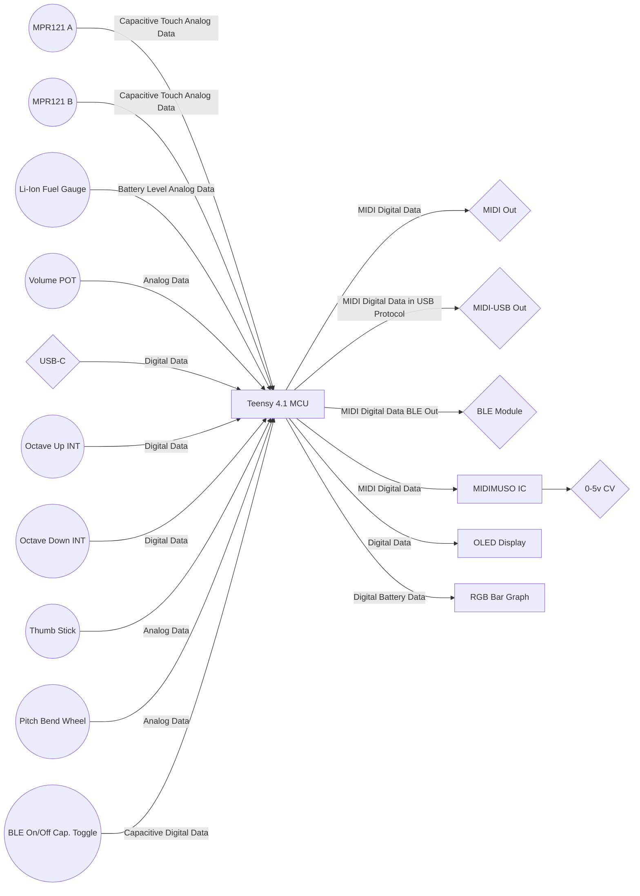

#
<h1 align="center">  
THE HARPY  
</h1>

 <h3 align="center">
	24-STRING LYRE MIDI CONTROLLER
</h3>

 

	

	

### OVERVIEW
The Harpy is a MIDI controller packaged in the form factor of an annular lyre. It uses a [Teensy microcontroller](https://www.pjrc.com/teensy/) to sense capacitive touch signals, from conventionally strung metal strings, as well as a variety of other controls to produce MIDI commands, which are then transmitted via a variety of outputs. 

The instrument may be used either while connect to an external power source our by using an onboard Li-ion battery.

### INSPERATION
So, I've always wanted to pick up a new instrument, but frankly none of the traditional instruments have ever really seemed like a great fit. As an engineer I've always been a bit mystified by what I've always perceived as a perplexing combination of valves, strings, bow positions, perfect fifths, arbitrary key placements, all controlled by what I've always viewed as a rather arcane set of knowledge and theory. However, that changed when I learned that I could just invent my own bespoke instrument and it could sound like anything I liked.

The idea was sparked while watching a video from [Look Mum No Computer](www.lookmumnocomputer.com), where he mentioned how people had made MIDI controllers in all sorts of shapes, sizes, and form factors. In particular he mentioned [a project](https://www.nutsvolts.com/magazine/article/build-a-midi-lyre) on [Nuts and Volts](https://www.nutsvolts.com/), where someone had made a MIDI lyre that used capacitive touch strings using the [Adafruit MPR121 breakout boards](https://www.adafruit.com/product/1982).  Simultaneously, I was also gleaning how mathematics influenced music through [a D&D podcast](https://bombardedcast.com/about) I've listened to.

This sent me down one rabbit hole after another: MIDI specifications, capacitive touch, serial communication, MCU architecture, baud rates, PCB design, music history, and music theory among others. After which I decided that I would attempt to make what I feel is an improvement on the original concept in both aesthetics and functionality. 

### FEATURES AND ASTHETICS
When I began to doodle potential designs for this instrument, I laid out the following features that I wanted in the instrument.

#### DESIGN FEATURES

 - The primary form of the instrument would be a minimalist annulus, [because annuli are cool](https://tron.fandom.com/wiki/Identity_Disc)!
 - The body would primarily be a CNC machine plywood body in two halves, a front and back.
 - The instrument would have an elegant color scheme of translucent grey, white, antiqued brass, light colored finished wood, and warm orange lighting.

  
  

#### HARDWARE FEATURES

 1. The main body will be machined from formaldehyde free grade A-2 or higher maple plywood.
 2. Epoxied threaded inserts will be used to fasten the two main halves of the instrument together. 
 2\.1 Threaded inserts and machine screw materials will be selected to avoid galling and galvanic corrosion.
 3. The section of the instrument that covers the electronics will be covered with translucent grey polycarbonate cover. 
 3\.1 The translucency of the cover will be controlled through media blasting, thus allowing for a fully transparent section for an OLED screen.
4. Where possible all external controls will be made from antiqued and clear coated brass hardware
4\.1 Controls will mimic the size and ergonomics of a PS4 wireless controller.
6. Lyre sized zither pins will be used to tension the strings of the instrument
7. Stainless steel strings will be used to prevent corrosion of the strings due to oils from fingers.
8. Lyre grommets will be used to secure the strings to the sound board of the lyre
9.  The strings will be silenced using a padded bridge and possible weights on the strings to prevent extraneous noise from the
    controller
10. A PCB will be fabricated to support the following: Data in, MIDI out via USB-C, traditional MIDI out, MIDI out via 3.4 SRT socket,
0-5v CV out via 3.5mm SRT socket, and LED indicators of data in and out of the instrument.
11. A 3D-printed battery package to allow for quick change outs of Li-ion batteries.
12. An RGB LED bar graph may be added to indicate battery level

#### ELECTRONICS FEATURES  
  
1. All IC's will be socketed for maintenance, replacement, and upgrade
2. Qwiic connectors will be used to communicate with as many sensors and modules and possible to simplify the replacement and wiring of parts.
3. A Teensy 4.1 will be used as the MCU w/ a socket for maintenance, replacement, and upgrade.
4. Corded power will be provided via USB type-C.
4\.1 Data from the USB-C will be routed to the microcontroller via modified USB-C cable.
4\.2 Power from the USB-C will be routed to the power management module to avoid over voltage issues.
5. Power management will be performed via an [Adafruit PowerBoost 1000C](https://www.adafruit.com/product/2465).
5\.1Power will be stepped up from the 3.7v at the battery to 5.4v. This will run the microprocessor and allow for a logic shifter to shift the digital data from the MCU from 3.3v to 5v signals. This is accomplished onboard the PowerBoost 1000C.
6. Battery voltage levels will be monitored using a [Sparkfun Fuel Gauge](https://www.sparkfun.com/products/10617) for Li-ion batteries.

Harpy Data Flow Chart:

